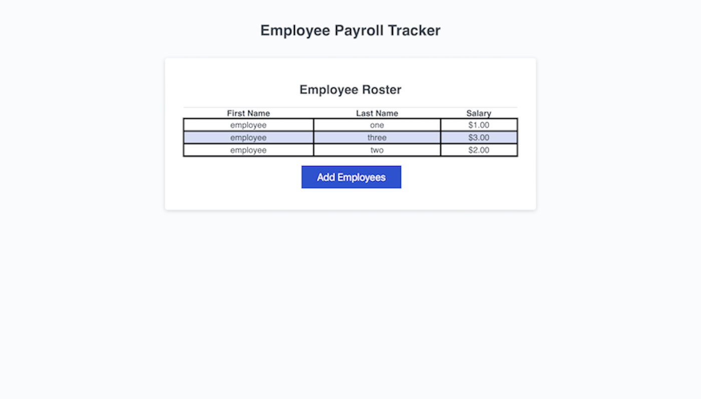

# Employee-Payroll-Tracker

## Description 
My motivation was to make a simple site page that allows to collect employees payroll & name. I worked on this project because the current written code was not functioning so I modified to make it work. The problem I solved was with the java script code. I learned more about java script & how I can use it to make a website function better & cleaner. This project for module 3 challenge is a website where you can add your employee payroll, names & salary. The average will be given & each employee will be in alphabetical order. I was given previously written code that I was instructed to modify & make sure all functions work. This project can be helpful or useful for hiring managers or someone else perhaps to keep a list of employees in alphabetical order with the option to see the average salary. The site is very easy to use & navigate. The look of the site is simple & straightforward with only 1 page. 

## Code Structure and Technologies Used

This project primarily utilizes HTML, CSS, and JavaScript to create a simple and functional employee payroll tracker. Here's a brief overview of the structure of the code:

- **HTML:** The HTML file (`index.html`) provides the structure and content of the web page. It includes elements for inputting employee data and displaying the results.

- **CSS:** The CSS file (`styles.css`) styles the HTML elements, providing visual enhancements and layout adjustments for better user experience.

- **JavaScript:** The JavaScript file (`script.js`) is responsible for the dynamic behavior of the web page. It handles user interactions, such as adding employee data, calculating average salary, and sorting employees in alphabetical order.

The project follows a modular approach, with separate files for HTML, CSS, and JavaScript, making it easier to maintain and understand.

Technologies/Libraries Used:
- HTML
- CSS
- JavaScript 

Additional dependencies:
- None

## Installation 

No need for installation, can load the page on a browser.

## Usage
Site is access at the following link : https://dannymcq2.github.io/module3employeedata/
The following screenshot shows the site while in use : 
    

## License

MIT License

Copyright (c) [2024] [Danny McHugh]

Permission is hereby granted, free of charge, to any person obtaining a copy
of this software and associated documentation files (the "Software"), to deal
in the Software without restriction, including without limitation the rights
to use, copy, modify, merge, publish, distribute, sublicense, and/or sell
copies of the Software, and to permit persons to whom the Software is
furnished to do so, subject to the following conditions:

The above copyright notice and this permission notice shall be included in all
copies or substantial portions of the Software.

THE SOFTWARE IS PROVIDED "AS IS", WITHOUT WARRANTY OF ANY KIND, EXPRESS OR
IMPLIED, INCLUDING BUT NOT LIMITED TO THE WARRANTIES OF MERCHANTABILITY,
FITNESS FOR A PARTICULAR PURPOSE AND NONINFRINGEMENT. IN NO EVENT SHALL THE
AUTHORS OR COPYRIGHT HOLDERS BE LIABLE FOR ANY CLAIM, DAMAGES OR OTHER
LIABILITY, WHETHER IN AN ACTION OF CONTRACT, TORT OR OTHERWISE, ARISING FROM,
OUT OF OR IN CONNECTION WITH THE SOFTWARE OR THE USE OR OTHER DEALINGS IN THE
SOFTWARE.

## Features

Make a chart of your employees salary with name. Have them sorted in alphabetical order, able to get average of salary when done.

